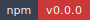
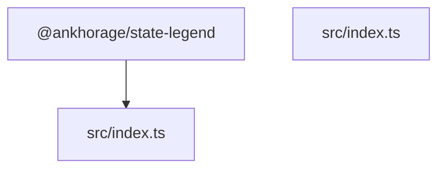

<!-- markdownlint-disable MD013 MD033 -->
<!-- This file is generated by Paradox. Do not edit manually. -->

# @ankhorage/state-legend

        

Legend State adapter for the provider-neutral `StateAdapter` contracts from
`@ankhorage/contracts`.

The package keeps Legend State behind the adapter boundary:

```txt
Legend State
  -> @ankhorage/state-legend
  -> StateAdapter
  -> runtime binding resolver
  -> plain props
  -> ZORA components
```

ZORA, runtime, Studio, Supabase, React Native, and Expo are intentionally not
imported by this package.

## Install

```bash
bun add @ankhorage/state-legend @ankhorage/contracts @legendapp/state@beta
```

## Usage

```ts
import { createLegendStateAdapter } from '@ankhorage/state-legend';

const stateAdapter = createLegendStateAdapter({
  initialState: {
    session: {
      user: null,
    },
  },
});

stateAdapter.set('forms.contact.values.firstname', 'Fabio');
const result = stateAdapter.get('forms.contact.values.firstname');

if (result.ok) {
  console.log(result.data);
}
```

## API

```ts
createLegendStateAdapter(options?: LegendStateAdapterOptions): StateAdapter
```

Features:

- path-based `get`
- path-based `set`
- path-based `subscribe`
- optional path-based `delete`
- deterministic unsubscribe
- no React dependency in the core adapter

## Generated documentation

- [Interactive documentation app](././paradox/index.html)
- [Public API reference](././paradox/exports.md)
- [Component registry](././paradox/components.md)
- [Architecture overview](././paradox/diagrams/architecture-overview.mmd)
- [Module relationships](././paradox/diagrams/module-relationships.mmd)
- [Export graph](././paradox/diagrams/export-graph.mmd)

## Architecture preview

<details>
<summary>Architecture overview</summary>



</details>
